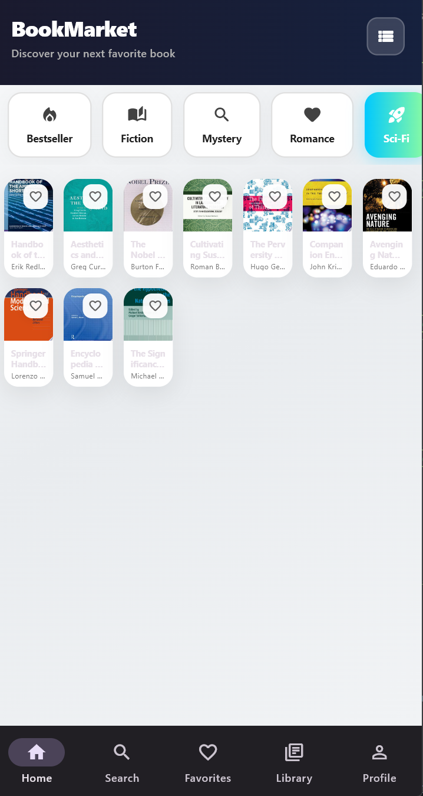
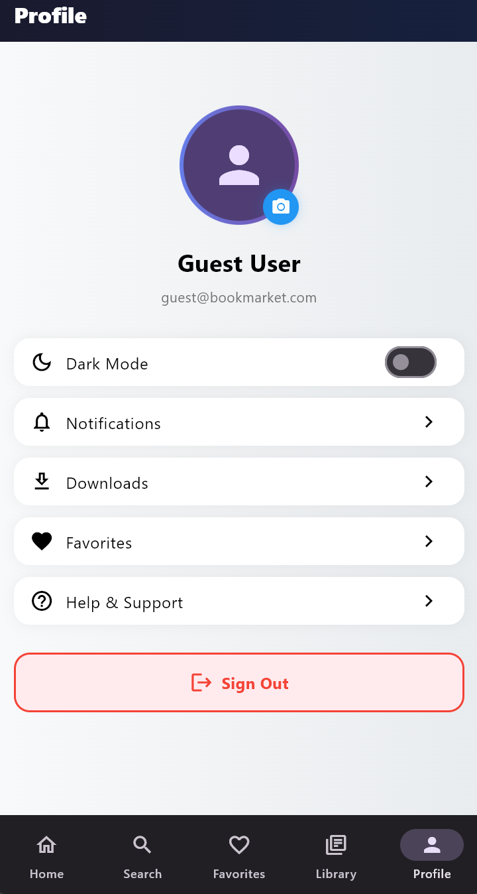
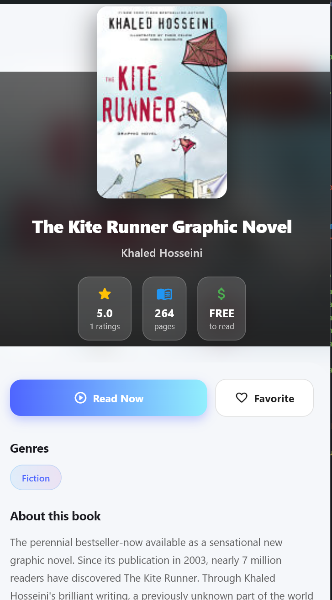
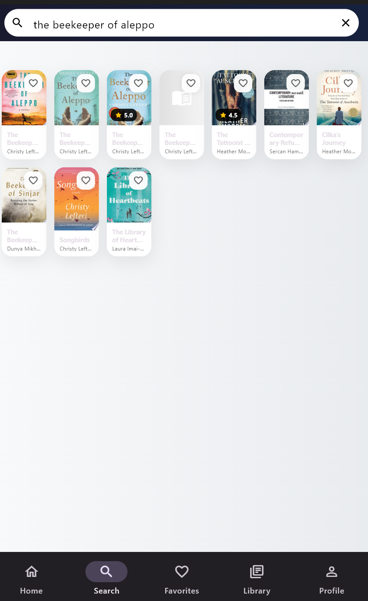
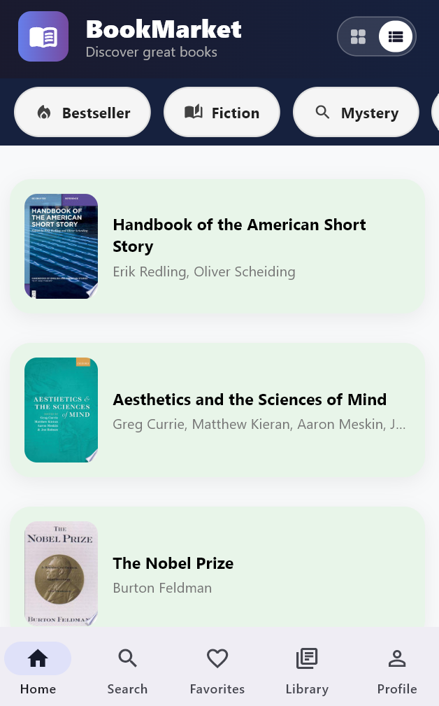

**Novella** is a modern, beautiful eBook marketplace and reader app built with Flutter.  
Switch between a card/grid and list view, browse categories, and enjoy a polished, responsive UI.

---

##  Features

- Clean, modern desktop & mobile layout
- **Flexible grid/list switch:** Instantly toggle between a 7-column grid and easy-to-read list
- **Animated, scrollable categories:** Bestseller, Fiction, Mystery, Romance, Sci-Fi, and more
- **Responsive design:** Layout adapts for desktop and mobile
- Parallax covers & beautiful book detail cards
- Smooth search, responsive navigation
- Built with **Flutter Riverpod** state management
- Ready for Windows, Web, Android, and iOS

---

##  Getting Started

**Requirements:**
- Flutter 3.0 or above
- Dart 3.0 or above

**Clone & Run:**
git clone https://github.com/Sadikn7i/novella-app.git

---

##  Screenshots

| Card Grid | Category Bar | Book List | Detail View | ... |
|-----------|--------------|-----------|-------------|-----|
|  |  |  |  |  |

---

##  Security & Privacy

- API keys, secrets, and personal credentials are **never included** (see `.gitignore`)
- **All sensitive & build files** are protected from public exposure

---

##  Creator & Contact

**Sadik Aden Dirir**

- [ORCID](https://orcid.org/0000-0002-8159-5442)
- [Instagram](https://www.instagram.com/sadiq_n7i/)
- [X / Twitter](https://x.com/sadikadendirir)
- [LinkedIn](https://www.linkedin.com/in/sadik-aden-a24440385/)
- [CodePen](https://codepen.io/lost-spirit-the-animator)

---

##  Contributions

Open for feedback and friendly PRs!

---

##  License

MIT — _please see [LICENSE](LICENSE) for details_

---

> **Novella** — Discover millions of books, your way.
